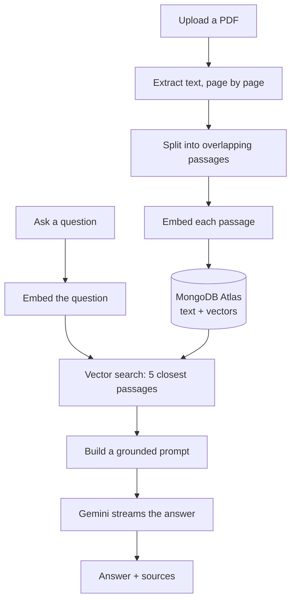

# DocChat

Upload a PDF and ask questions about it. Answers are written by an LLM but built
only from passages found in your document, and every answer shows the passages it
searched, with page numbers and match scores.

**Live:** https://docchat-navy.vercel.app/

---

## How it works

This is a RAG pipeline (Retrieval-Augmented Generation). A language model cannot
read a whole document on every question, and left to itself it will answer from
its own knowledge. So the document is searched first, and the model is given only
the passages that matched.



**Ingestion.** Text is extracted one page at a time so every passage keeps the
page it came from — that is what lets an answer cite a page. Each passage becomes
an embedding (a list of numbers where similar meaning lands nearby), and the text
and its vector are stored together in one MongoDB document.

**Answering.** The question is embedded the same way, MongoDB returns the five
nearest passages, and those become the context of a prompt that tells the model
to answer from them alone and to say so plainly when the answer is not there.

---

## Chunking and retrieval

| Setting            | Value           | Why                                                                                                                                                                                                                                                                              |
| ------------------ | --------------- | -------------------------------------------------------------------------------------------------------------------------------------------------------------------------------------------------------------------------------------------------------------------------------- |
| Chunk size         | 1000 characters | About 250 tokens for Latin script (roughly 4 characters per token). Small enough that one passage is about one idea, so its embedding stays sharp; large enough to keep a sentence in context.                                                                                                     |
| Overlap            | 200 characters  | A sentence cut across a boundary still appears whole in one of the two passages. Without it, a split sentence can match neither.                                                                                                                                                 |
| Passages retrieved | 5               | Enough for an answer spread across several passages, few enough that the prompt stays focused.                                                                                                                                                                                   |
| Embedding size     | 1536            | `gemini-embedding-001` returns 3072 by default. The model is trained so a shortened vector stays meaningful, so this halves storage (~21 KB per passage instead of ~42 KB — a clean 2x). Measured on real text, 1536 separated matching from non-matching passages slightly better than 3072. |
| Similarity         | Cosine          | Compares the direction two vectors point rather than their length. Direction carries the meaning; length mostly reflects how long the text was.                                                                                                                                  |

**Passages are split on line breaks, not paragraphs.** The obvious approach is to
split on blank lines, but extracted PDF text often has none — every visual line
simply ends with a newline. Splitting on double newlines would have produced one
enormous passage. Splitting on single line breaks matched how the documents are
actually laid out.

Sentence splitting was tested too and rejected: on a document with tables and
numbered sections it produced fragments as short as 2 characters (the section
numbers) and segments as long as 678, because dots appear inside names and
numbering as often as at the end of sentences.

**Passages never span two pages,** so every page number is exact. The cost is
that an idea running across a page break gets split.

---

## Why no similarity threshold

A natural idea is to reject results below some score and answer "not found".
Measured on a real document:

| Question                          | Best score |
| --------------------------------- | ---------- |
| A question the document answers   | 83–88%     |
| Gibberish (`eat nndslkdoa`)       | 79%        |
| A coherent but off-topic question | 74%        |

The bands overlap too much to cut between them — meaningless input scored higher
than a sensible off-topic question, because gibberish has no semantic direction
and lands at average distance from everything.

So there is no threshold in the code. The prompt instructs the model to say when
the passages do not contain the answer, and it does.

---

## Evaluation

Five questions run against the live deployment on
[`examples/Rapport_Projet_metier_devops.pdf`](examples/Rapport_Projet_metier_devops.pdf)
(13 pages, 33 passages). Scores are the top retrieval match for that question.

Answers are quoted from one run. The model does not return the same sentence
twice, so what is checked is whether the claim is correct and the cited page
really contains it — not whether the wording matches.

| # | Question | Expected | Answer | Top match | Result |
|---|---|---|---|---|---|
| 1 | Which CI/CD orchestrator was chosen, and why over the alternative? | Jenkins, for flexibility and hands-on infrastructure experience | "Jenkins was selected over GitHub Actions (page 10). It was chosen because, while GitHub Actions would have been simpler to set up, Jenkins provided greater flexibility and deeper learning opportunities, such as hands-on experience with infrastructure, troubleshooting, and system administration (page 10)." | p.9 · 86.9% | pass |
| 2 | Which tool performs static code analysis, and where does it run? | SonarQube, on its own Compute Engine VM | "SonarQube performs static code analysis, and it is hosted on a dedicated Compute Engine virtual machine (page 3)." | p.10 · 83.9% | fact right, page wrong |
| 3 | Where are the built Docker images stored? | Docker Hub | "The built Docker images are stored on Docker Hub (page 5)." | p.5 · 82.0% | pass |
| 4 | Combien de temps prend le pipeline après optimisation ? *(asked in French)* | About 13 minutes, answered in French | "Le pipeline prend environ 13 minutes après optimisation (page 7, page 12)." | p.7 · 86.1% | pass |
| 5 | What is the recipe for chocolate cake? | Refusal — not in the document | "The document does not cover it." | p.11 · 75.2% | pass |

**4 / 5.** Every cited page was checked against the source document.

Question 2 is the one that fails, and it is the useful row. The fact is right —
SonarQube does run on its own Compute Engine VM — but it cites page 3, and that
sentence is on page 5. Page 3 is the introduction and was not among the five
passages retrieved. So retrieval worked and the model attached a page number that
came from nowhere. This is why the sources panel shows the real pages next to
every answer: the reader can check the citation rather than trust it.

Question 4 is asked in French against an English document: retrieval works across
languages, and the answer comes back in the language of the question.

Question 5 is the important one. The document has nothing about cake, yet the
closest passage still scored **75.2%** — which is why there is no similarity
threshold. The refusal comes from the prompt, not from a score comparison.

Median response time was **1.5s**, and each answer plus its five source passages
totalled about **2.5 KB**.

## Tech choices

| Choice                                | Why                                                                                                                                                                                                                                                                                                         |
| ------------------------------------- | ----------------------------------------------------------------------------------------------------------------------------------------------------------------------------------------------------------------------------------------------------------------------------------------------------------- |
| **Next.js (App Router) + TypeScript** | API routes and UI in one deployable unit, `strict: true` throughout.                                                                                                                                                                                                                                        |
| **MongoDB Atlas Vector Search**       | The passage text and its vector live in the same document, so one query returns the text, page and score together — no second store to keep in sync.                                                                                                                                                        |
| **Google Gemini**                     | One key covers embeddings (`gemini-embedding-001`) and generation (`gemini-3.5-flash-lite`). Questions and passages are embedded with different task types (`RETRIEVAL_QUERY` / `RETRIEVAL_DOCUMENT`), which places a question near the passages that _answer_ it rather than ones that merely resemble it. |
| **Vercel AI SDK**                     | Handles token streaming and chat state. A library, not a framework — it does not touch the retrieval logic.                                                                                                                                                                                                 |
| **zod**                               | Validates every API input before anything expensive runs.                                                                                                                                                                                                                                                   |
| **Tailwind + shadcn/ui**              | shadcn copies component source into the repository instead of hiding it in a dependency.                                                                                                                                                                                                                    |

### Why not LangChain

LangChain packages these steps behind its own abstractions. This pipeline is
about 300 lines across five files in `lib/` — extract, chunk, embed, search,
prompt — and writing it directly keeps the chunking strategy, the retrieval
parameters and the prompt visible instead of configured through a framework. Its recursive text
splitter would be worth adopting if this had to handle arbitrary document types;
for these documents, line-break splitting measured better.

### Limits

Three caps are enforced on upload, each for a different reason.

| Limit     | Value | Why                                                                                                                                                                                                                                                     |
| --------- | ----- | -------------------------------------------------------------------------------------------------------------------------------------------------------------------------------------------------------------------------------------------------------- |
| File size | 4 MB  | A serverless request body is limited to about 4.5 MB. Checked in the browser for instant feedback and again on the server, which is the check that actually protects the endpoint. Larger files would need a direct-to-storage upload.                    |
| Pages     | 50    | Processing time scales with page count against a 60-second function timeout. This is the coarse guard — in practice the passage cap below usually rejects a long document first.                                                                         |
| Passages  | 100   | The embedding API allows 100 requests per minute and counts each passage separately, so a dense PDF hits that ceiling before the page cap does. Measured at 2.1–3.0 passages per page across three documents, so 100 passages is roughly 33–47 pages. |

The file-size check runs before the response stream opens, so it returns a real
`413`. The page and passage counts are only known after extraction, by which
point the `200` has been sent — those two arrive as an error line inside the
stream instead of as a status code.

### Serverless constraints

- **The database client is cached per process.** A serverless function serves
  many requests, so connecting on each one would exhaust the connection pool. The
  connection promise is created once and reused, and kept on `globalThis` so hot
  reload does not leak a new client on every edit in development.
- **Upload progress is streamed.** Processing takes 8–22 seconds, so the upload
  endpoint responds with newline-delimited JSON, emitting each stage as it
  finishes. Validation runs before the stream opens, so bad requests still return
  proper 400 and 413 codes; failures after that point arrive inside the stream.
- **New passages are not searchable instantly.** Atlas updates its vector index
  asynchronously, so a question asked immediately after an upload could find
  nothing. Uploading waits until the passages really are searchable before
  reporting success.
- **Logs are one JSON line per event.** Vercel captures stdout, so JSON can be
  filtered rather than read by eye. Uploads record a duration per stage, which
  separates a slow extraction from a slow embedding. Question and passage text
  are never logged — the documents are private.

---

## API

### `POST /api/upload`

Multipart form data with a `file` field. Responds with newline-delimited JSON:

```
{"stage":"parsing"}
{"stage":"chunking"}
{"stage":"embedding"}
{"documentId":"...","filename":"...","pageCount":13,"chunkCount":33}
```

| Status | When                                                |
| ------ | --------------------------------------------------- |
| 200    | Accepted; progress and result follow in the stream  |
| 400    | No file, empty file, not a PDF, or a malformed body |
| 413    | Larger than 4 MB                                    |

More than 50 pages, more than 100 passages, or a scanned PDF cannot be detected
until the file has been read, so they are reported inside the stream instead:

```
{"stage":"parsing"}
{"error":"This PDF has 77 pages and the limit is 50."}
```

### `POST /api/chat`

```json
{
	"documentId": "...",
	"messages": [
		{ "id": "1", "role": "user", "parts": [{ "type": "text", "text": "..." }] }
	]
}
```

Streams the answer token by token. The passages it searched are attached as
message metadata on the final frame only, so the same source block is not resent
with every token.

| Status | When                                                                  |
| ------ | --------------------------------------------------------------------- |
| 200    | The answer streams back                                               |
| 400    | `documentId` missing, no messages, no text in the last user message, more than 50 messages, or a question over 4000 characters |
| 500    | Retrieval or the model failed                                          |

**The whole conversation is sent to the model, but only the newest question is
used for retrieval.** The model sees the history and can resolve "it" in a
follow-up; the vector search cannot, so "and where does it run?" is searched on
those five words alone. Rewriting a follow-up into a standalone question before
searching is the usual fix, and it is not implemented here.

---

## Running it locally

Requires Node 20+, a [Google AI Studio](https://aistudio.google.com/) key, and a
free [MongoDB Atlas](https://www.mongodb.com/atlas) cluster.

```bash
git clone https://github.com/NotAnsar/docchat.git
cd docchat
npm install
cp .env.example .env      # then fill in both values
```

| Variable                       | Purpose                                      |
| ------------------------------ | -------------------------------------------- |
| `GOOGLE_GENERATIVE_AI_API_KEY` | Embeddings and generation. Server-side only. |
| `MONGO_URI`                    | Atlas connection string. Server-side only.   |

Neither is exposed to the browser — both are read inside API routes.

In Atlas, allow network access from `0.0.0.0/0` (serverless functions have no
fixed IP), then create the vector search index:

```bash
node --env-file=.env scripts/create-vector-index.mjs
```

The script is safe to re-run and waits until the index is ready.

```bash
npm run dev        # http://localhost:3000
npm test           # unit tests
npm run lint
npx tsc --noEmit
```

---

## Project structure

```
app/
  page.tsx              upload panel and chat side by side
  api/upload/route.ts   validate, extract, chunk, embed, store
  api/chat/route.ts     retrieve, build the prompt, stream the answer
lib/
  pdf.ts                text extraction and chunking
  embeddings.ts         Gemini embeddings
  mongodb.ts            cached database connection
  retrieval.ts          store passages and search them
  prompt.ts             build the grounded prompt
  logger.ts             one JSON line per event
  pdf.test.ts           chunking tests
  prompt.test.ts        prompt building tests
components/
  pdf-dropzone.tsx      drag and drop, rejects non-PDFs before upload
  upload-panel.tsx      progress stages and result
  chat-panel.tsx        session history, streamed answers, sources
  ui/                   shadcn/ui
examples/               sample PDF used for the evaluation above
scripts/                one-time vector index setup
```

Tests cover the two pure functions: chunking and prompt building. Everything else
talks to Gemini, MongoDB or the browser, so testing it would mean mocking the
part that actually matters. Writing these caught a real bug — a line longer than
the chunk size could push a chunk past its limit once the overlap was added.

---

## Limitations

**Scanned PDFs are rejected** with a clear message. Their pages are images and
would need OCR.

**Arabic mostly works.** PDF files store Arabic letters in a special display form
that the embedding model does not recognise. One line of code turns them back
into normal letters, and the answers got much better after that. The words still
come out in reverse order, so the source previews are hard to read.

**Sources shown are the passages searched, not proven-used.** The model is given
five passages and may use two. Having it name which ones it used would be more
accurate.
