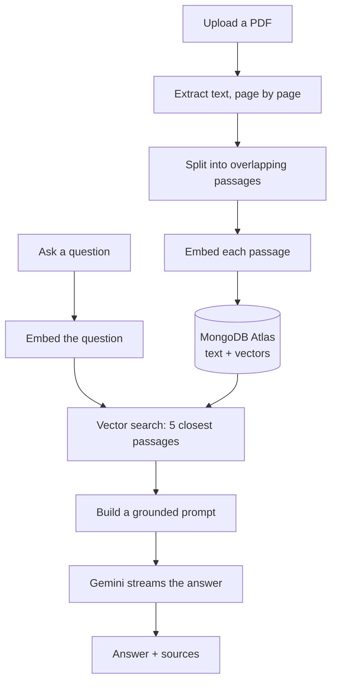

# DocChat

Upload a PDF and ask questions about it. Answers are written by an LLM but built
only from passages found in your document, and every answer shows the passages it
searched, with page numbers and match scores.

**Live:** https://docchat-navy.vercel.app/

---

## How it works

This is a RAG pipeline (Retrieval-Augmented Generation). A language model cannot
read a whole document on every question, and left to itself it will answer from
its own knowledge. So the document is searched first, and the model is given only
the passages that matched.



**Ingestion.** Text is extracted one page at a time so every passage keeps the
page it came from — that is what lets an answer cite a page. Each passage becomes
an embedding (a list of numbers where similar meaning lands nearby), and the text
and its vector are stored together in one MongoDB document.

**Answering.** The question is embedded the same way, MongoDB returns the five
nearest passages, and those become the context of a prompt that tells the model
to answer from them alone and to say so plainly when the answer is not there.

---

## Chunking and retrieval

| Setting            | Value           | Why                                                                                                                                                                                                                                                                              |
| ------------------ | --------------- | -------------------------------------------------------------------------------------------------------------------------------------------------------------------------------------------------------------------------------------------------------------------------------- |
| Chunk size         | 1000 characters | About 250 tokens for Latin script (roughly 4 characters per token). Small enough that one passage is about one idea, so its embedding stays sharp; large enough to keep a sentence in context.                                                                                                     |
| Overlap            | 200 characters  | A sentence cut across a boundary still appears whole in one of the two passages. Without it, a split sentence can match neither.                                                                                                                                                 |
| Passages retrieved | 5               | Enough for an answer spread across several passages, few enough that the prompt stays focused.                                                                                                                                                                                   |
| Embedding size     | 1536            | `gemini-embedding-001` returns 3072 by default. The model is trained so a shortened vector stays meaningful, so this halves storage (~21 KB per passage instead of ~42 KB — a clean 2x). Measured on real text, 1536 separated matching from non-matching passages slightly better than 3072. |
| Similarity         | Cosine          | Compares the direction two vectors point rather than their length. Direction carries the meaning; length mostly reflects how long the text was.                                                                                                                                  |

**Passages are split on line breaks, not paragraphs.** The obvious approach is to
split on blank lines, but extracted PDF text often has none — every visual line
simply ends with a newline. Splitting on double newlines would have produced one
enormous passage. Splitting on single line breaks matched how the documents are
actually laid out.

Sentence splitting was tested too and rejected: on a document with tables and
numbered sections it produced fragments as short as 2 characters (the section
numbers) and segments as long as 678, because dots appear inside names and
numbering as often as at the end of sentences.

**Passages never span two pages,** so every page number is exact. The cost is
that an idea running across a page break gets split.

---

## Why no similarity threshold

A natural idea is to reject results below some score and answer "not found".
Measured on a real document:

| Question                          | Best score |
| --------------------------------- | ---------- |
| A question the document answers   | 83–88%     |
| Gibberish (`eat nndslkdoa`)       | 79%        |
| A coherent but off-topic question | 74%        |

The bands overlap too much to cut between them — meaningless input scored higher
than a sensible off-topic question, because gibberish has no semantic direction
and lands at average distance from everything.

So there is no threshold in the code. The prompt instructs the model to say when
the passages do not contain the answer, and it does.

---

## Tech choices

| Choice                                | Why                                                                                                                                                                                                                                                                                                         |
| ------------------------------------- | ----------------------------------------------------------------------------------------------------------------------------------------------------------------------------------------------------------------------------------------------------------------------------------------------------------- |
| **Next.js (App Router) + TypeScript** | API routes and UI in one deployable unit, `strict: true` throughout.                                                                                                                                                                                                                                        |
| **MongoDB Atlas Vector Search**       | The passage text and its vector live in the same document, so one query returns the text, page and score together — no second store to keep in sync.                                                                                                                                                        |
| **Google Gemini**                     | One key covers embeddings (`gemini-embedding-001`) and generation (`gemini-3.5-flash-lite`). Questions and passages are embedded with different task types (`RETRIEVAL_QUERY` / `RETRIEVAL_DOCUMENT`), which places a question near the passages that _answer_ it rather than ones that merely resemble it. |
| **Vercel AI SDK**                     | Handles token streaming and chat state. A library, not a framework — it does not touch the retrieval logic.                                                                                                                                                                                                 |
| **zod**                               | Validates every API input before anything expensive runs.                                                                                                                                                                                                                                                   |
| **Tailwind + shadcn/ui**              | shadcn copies component source into the repository instead of hiding it in a dependency.                                                                                                                                                                                                                    |

### Why not LangChain

LangChain packages these steps behind its own abstractions. This pipeline is
about 200 lines — extract, chunk, embed, search, prompt — and writing it directly
keeps the chunking strategy, the retrieval parameters and the prompt visible in a
few small files instead of configured through a framework. Its recursive text
splitter would be worth adopting if this had to handle arbitrary document types;
for these documents, line-break splitting measured better.

### Serverless constraints

- **Uploads are capped at 4 MB.** Serverless request bodies are limited to about
  4.5 MB. The limit is checked in the browser for instant feedback and again on
  the server, which is the check that actually protects the endpoint. Larger
  files would need a direct-to-storage upload.
- **The database client is cached per process.** A serverless function serves
  many requests, so connecting on each one would exhaust the connection pool. The
  connection promise is created once and reused, and kept on `globalThis` so hot
  reload does not leak a new client on every edit in development.
- **Upload progress is streamed.** Processing takes 8–22 seconds, so the upload
  endpoint responds with newline-delimited JSON, emitting each stage as it
  finishes. Validation runs before the stream opens, so bad requests still return
  proper 400 and 413 codes; failures after that point arrive inside the stream.
- **New passages are not searchable instantly.** Atlas updates its vector index
  asynchronously, so a question asked immediately after an upload could find
  nothing. Uploading waits until the passages really are searchable before
  reporting success.

---

## API

### `POST /api/upload`

Multipart form data with a `file` field. Responds with newline-delimited JSON:

```
{"stage":"parsing"}
{"stage":"chunking"}
{"stage":"embedding"}
{"documentId":"...","filename":"...","pageCount":15,"chunkCount":34}
```

| Status | When                                                |
| ------ | --------------------------------------------------- |
| 200    | Accepted; progress and result follow in the stream  |
| 400    | No file, empty file, not a PDF, or a malformed body |
| 413    | Larger than 4 MB                                    |

### `POST /api/chat`

```json
{
	"documentId": "...",
	"messages": [
		{ "id": "1", "role": "user", "parts": [{ "type": "text", "text": "..." }] }
	]
}
```

Streams the answer token by token, with the passages it searched attached as
message metadata. `400` if `documentId` or the messages are missing.

---

## Running it locally

Requires Node 20+, a [Google AI Studio](https://aistudio.google.com/) key, and a
free [MongoDB Atlas](https://www.mongodb.com/atlas) cluster.

```bash
git clone https://github.com/NotAnsar/docchat.git
cd docchat
npm install
cp .env.example .env      # then fill in both values
```

| Variable                       | Purpose                                      |
| ------------------------------ | -------------------------------------------- |
| `GOOGLE_GENERATIVE_AI_API_KEY` | Embeddings and generation. Server-side only. |
| `MONGO_URI`                    | Atlas connection string. Server-side only.   |

Neither is exposed to the browser — both are read inside API routes.

In Atlas, allow network access from `0.0.0.0/0` (serverless functions have no
fixed IP), then create the vector search index:

```bash
node --env-file=.env scripts/create-vector-index.mjs
```

The script is safe to re-run and waits until the index is ready.

```bash
npm run dev        # http://localhost:3000
npm test           # unit tests
npm run lint
npx tsc --noEmit
```

---

## Project structure

```
app/
  page.tsx              upload panel and chat side by side
  api/upload/route.ts   validate, extract, chunk, embed, store
  api/chat/route.ts     retrieve, build the prompt, stream the answer
lib/
  pdf.ts                text extraction and chunking
  embeddings.ts         Gemini embeddings
  mongodb.ts            cached database connection
  retrieval.ts          store passages and search them
  prompt.ts             build the grounded prompt
components/             upload panel, chat panel, shadcn/ui
scripts/                one-time vector index setup
```

Tests cover the two pure functions: chunking and prompt building. Writing them
caught a real bug — a line longer than the chunk size could push a chunk past its
limit once the overlap was added.

---

## Limitations

**Scanned PDFs are rejected** with a clear message. Their pages are images and
would need OCR.

**Sources shown are the passages searched, not proven-used.** The model is given
five passages and may use two. Having it name which ones it used would be more
accurate.
