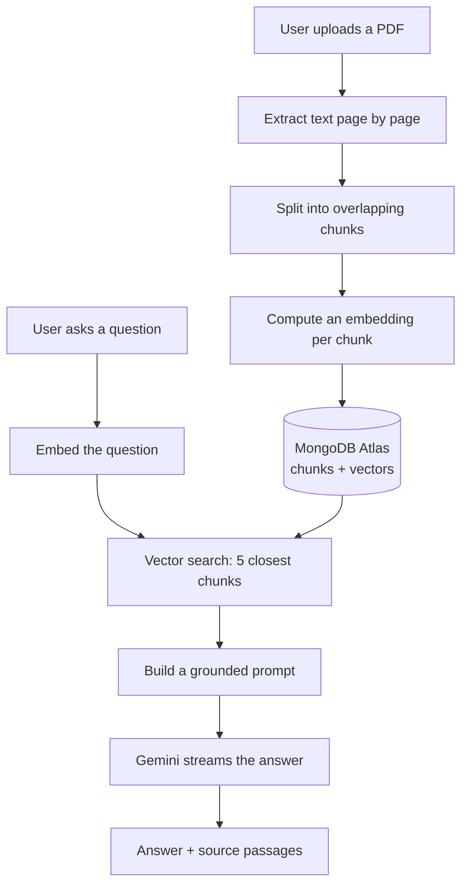

# DocChat

Upload a PDF, ask questions about it in plain language. Answers are generated by
an LLM but built **only** from passages found in your document, and every answer
shows the passages it used, with page numbers and match scores.

**Live app:** https://docchat-navy.vercel.app/

---

## How it works

The app implements a RAG pipeline (Retrieval-Augmented Generation). The idea: an
LLM cannot read a whole document on every question, and we do not want it
answering from its general knowledge. So we search the document first, then ask
the LLM to answer using only what we found.



**Ingestion** — the PDF text is extracted one page at a time, so every chunk
keeps the page it came from and answers can cite it. The text is split into
overlapping chunks, each chunk is converted into an embedding (a vector of
numbers where similar meaning produces nearby vectors), and both the text and its
vector are stored in MongoDB.

**Querying** — the question goes through the same embedding model, MongoDB
returns the 5 most similar chunks by cosine similarity, and those chunks become
the context of a prompt that instructs the model to answer from them alone and to
say so plainly when the answer is not there.

---

## Chunking and retrieval strategy

| Parameter | Value | Reason |
|---|---|---|
| Chunk size | ~1000 characters | Roughly 250 tokens. Small enough that a chunk covers one idea, which keeps retrieval precise; large enough to keep a sentence in context. |
| Overlap | 200 characters | An idea that falls across a boundary still appears whole in one of the two chunks. Without overlap, a sentence split in half can become unretrievable. |
| Chunks retrieved | 5 | Enough to answer questions whose answer is spread over several passages, without filling the prompt with irrelevant text that degrades the answer. |
| Embedding size | 1536 dimensions | `gemini-embedding-001` returns 3072 by default. The model is trained so that a truncated vector stays meaningful, so 1536 halves index size and memory for a negligible loss in retrieval quality. |
| Similarity | Cosine | Standard for text embeddings: it compares direction (meaning) rather than magnitude (length). |
| Page tracking | Per chunk | Required to cite sources, which is what makes the answer verifiable. |

Splitting happens on paragraph boundaries where possible, so chunks tend to break
where the document itself breaks rather than mid-sentence.

---

## Technical choices

| Choice | Why |
|---|---|
| **Next.js (App Router) + TypeScript** | Required by the brief. API routes and UI in one deployable unit, `strict: true` across the project. |
| **MongoDB Atlas Vector Search** | Stores chunk text and its vector in the same document, so retrieval is a single `$vectorSearch` query with no second datastore to keep in sync. Also removes the need for a separate vector database. |
| **Google Gemini** | One API key covers both embeddings (`gemini-embedding-001`) and generation (`gemini-3.6-flash`), and the free tier is enough for this workload. |
| **Vercel AI SDK** | Handles token streaming and chat state on the client. It is a library, not a framework: it does not touch the retrieval logic. |
| **zod** | Validates every API input (file type, file size, question shape) before anything else runs. |
| **Tailwind CSS + shadcn/ui** | shadcn copies component source into the repository rather than hiding it in a dependency, so the UI code is readable and modifiable. |

### Why not LangChain

LangChain packages the RAG steps behind its own abstractions. This pipeline is
small enough to write directly — extract, chunk, embed, search, prompt — and
writing it directly means the chunking strategy, the retrieval parameters, and
the prompt are all visible and adjustable in a few files instead of configured
through a framework. For a project of this size the framework would add a
dependency and hide the part that matters most.

### Serverless constraints

The app runs on Vercel serverless functions, which shapes two decisions:

- **Upload size is capped at 4 MB.** Serverless request bodies are limited to
  about 4.5 MB, so the limit is enforced and reported to the user instead of
  failing mid-request. Larger files would need a direct-to-storage upload.
- **The MongoDB client is cached across invocations.** A serverless function can
  be reused for several requests; opening a new database connection each time
  would exhaust the connection pool. The client is created once per warm instance
  and reused.

---

## Getting started

### Prerequisites

- Node.js 20 or later
- A [Google AI Studio](https://aistudio.google.com/) API key (free)
- A [MongoDB Atlas](https://www.mongodb.com/atlas) cluster (free M0 tier)

### 1. Install

```bash
git clone https://github.com/NotAnsar/docchat.git
cd docchat
npm install
```

### 2. Configure the environment

Copy the example file and fill in your own values:

```bash
cp .env.example .env
```

| Variable | Purpose |
|---|---|
| `GOOGLE_GENERATIVE_AI_API_KEY` | Calls the Gemini embedding and chat models. Server-side only. |
| `MONGO_URI` | Connection string for the Atlas cluster storing chunks and vectors. Server-side only. |

Neither variable is exposed to the browser: they are read inside API routes,
which run on the server.

### 3. Prepare the database

In the Atlas dashboard, allow network access from anywhere (`0.0.0.0/0`) —
serverless functions have no fixed IP address — and create a vector search index
on the collection storing the chunks.

### 4. Run

```bash
npm run dev
```

Open [http://localhost:3000](http://localhost:3000).

### Other commands

```bash
npm run build      # production build
npm run lint       # ESLint
npx tsc --noEmit   # type check
```

---

## Project structure

```
app/
  page.tsx           the interface: upload panel and chat
  layout.tsx         root layout and page metadata
  api/               upload and chat endpoints
lib/                 PDF extraction, chunking, embeddings, database access
components/ui/       shadcn/ui components (source lives in the repo)
```

---

## Status

Built so far: project setup and the full interface. The RAG pipeline, the API
endpoints, and deployment are in progress — see the commit history.
